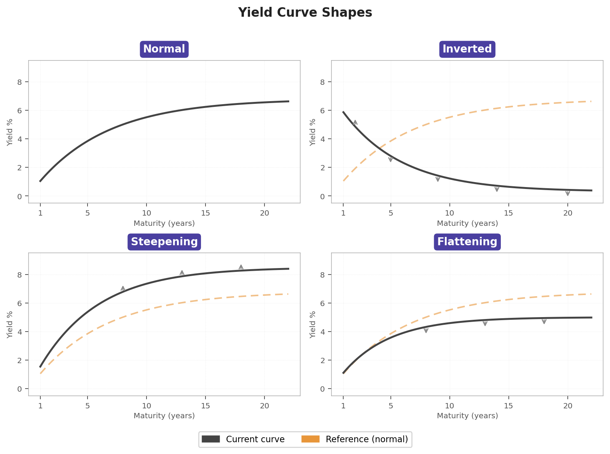

## Interest rates, bonds, XX-year treasury yield — what does all that mean?

Interest rates are key indicators that reveal a great deal about what is happening in the world. For example, during the 2008 financial crisis, interest rates rose significantly. In contrast, during the COVID-19 crisis in 2020, we observed a drastic decline in interest rates, with some even turning negative. More recently, during tensions between Iran and the United States, movements in 10-year bond yields raised concerns about potential inflation.

Until recently, you may have been unfamiliar with terms such as "bonds," "XX-year bond yields," and "interest rates," as well as their impact on the economy. If so, you are in the right place. In this article, we aim to demystify the concept of interest rates.

According to the concept of time value of money, a dollar today is worth more than a dollar tomorrow. This can be explained by different mechanisms. For example, since the future is uncertain, a dollar promised tomorrow carries more risk than a dollar received today. Hence, what can justify lending money — and thus forgoing its immediate use? Interest rates.

An interest rate can be seen as the cost of borrowing or the return on lending. For example, suppose a counterparty A lends money today to B, who must reimburse it in five days. To compensate for the renunciation of liquidity now, B reimburses A, at what we call the maturity date, the initial amount plus a fraction of the sum borrowed. This fraction is the interest rate.

Another instrument illustrates the same mechanism: the zero-coupon bond. Here, rather than specifying an interest rate explicitly, the compensation for waiting is embedded in the price. A zero-coupon bond is a contract that guarantees its holder one dollar at maturity date $T$ — with no intermediate payments. Since that dollar is received in the future, the buyer pays less than one dollar for it today. The difference between the price paid and the dollar received at $T$ is precisely what compensates the lender for the time and risk of waiting.

## The link between bonds and interest rates

The link between bonds and interest rates is quite simple. In order to understand this, let's consider two investment strategies that should, in a no-arbitrage world, yield the same return.

To formalize the example, let's denote $r(t,T)$ the simple interest rate fixed at time $t$ and applying until $T$. A sum $X$ invested at time $t$ will therefore be worth $X + X \cdot r(t,T) \cdot (T-t)$ at time $T$.

Now consider a zero-coupon bond: we pay $B(t,T)$ at time $t$ to receive $1$ at maturity $T$. Alternatively, we can invest the same amount $B(t,T)$ in a money market account that pays the simple spot rate $r(t,T)$. At maturity $T$, this second strategy yields $B(t,T) \cdot (1 + (T-t) \cdot r(t,T))$.

Since we are in a no-arbitrage framework, both strategies must produce the same payoff at maturity $T$, which gives:

$$
1 = B(t,T) \cdot (1 + (T-t) \cdot r(t,T)) \quad \Longleftrightarrow \quad r(t,T) = \frac{1}{T-t} \left( \frac{1}{B(t,T)} - 1 \right).
$$

In practice, continuous compounding is generally preferred. To emphasize this change in convention, we will denote $R(t,T)$ the continuously compounded rate, as opposed to the simple rate $r(t,T)$. Writing $B(t,T) = e^{-(T-t) R(t,T)}$ and identifying with the expression above, we obtain the following equivalent relationship:

$$
1 = B(t,T) \cdot e^{(T-t) R(t,T)} \quad \Longleftrightarrow \quad R(t,T) = -\frac{1}{T-t} \ln B(t,T).
$$

As one can see, there is an inversely proportional relationship between the interest rate and the zero-coupon bond price. Under normal conditions, we tend to observe an increasing term structure of interest rates, meaning that lenders are willing to lend their money over the long term only if they receive a higher rate of return as compensation for time and risk. Consequently, the zero-coupon bond price curve will be decreasing and convex, meaning that bond prices decline as maturity increases, but at a decreasing rate.

Since both $r(t,T)$ and $B(t,T)$ depend on $t$ and $T$, in order to obtain a curve one needs to fix one of the two parameters. The most common convention is to fix the observation date $t$ and let the maturity $T$ vary — this gives rise to what is called the **yield curve** (or term structure of interest rates), which represents the interest rate as a function of maturity [@ecbyieldcurve].

Conversely, fixing $T$ and varying $t$ gives the time evolution of the rate for a given maturity, giving rise to what is called a $T$-year bond rate curve [@ecbsr10y]. It is called the $T$-year Treasury yield when the bond used as reference is a US government bond (issued by the US Department of the Treasury).

## Why is it important to model the interest rate curve?

It is important to model the interest rate curve because it is a fundamental input in almost every area of finance. It allows us to price and value a wide range of financial instruments — from simple bonds to complex interest rate derivatives — by providing the discount rates needed to bring future cash flows back to their present value. Knowing that 1 euro today will be worth $1 + r \cdot T$ in $T$ years, we can derive the present value of 1 euro received at time $T$, which is simply $1/(1 + r \cdot T)$ today. One of the famous model used for interest rate is the vasicek model for the short rate process $r_t$, which is basically the interest rate $r(t, t+dt)$ applied over an infinitesimally small period of time $dt$.

Depending on the conditions of the economy, we will observe various types of interest rate curves:

- **Normal curve**: the yield curve is upward sloping, meaning long-term rates are higher than short-term rates. This reflects the typical expectation that lenders demand higher compensation for tying up their money over longer periods, and that the economy is in a healthy growth regime.

- **Inverted curve**: short-term rates exceed long-term rates, producing a downward sloping curve. This is often interpreted as a signal that markets expect economic slowdown or recession ahead, as investors anticipate that central banks will cut rates in the future and therefore want higher compensation now.

- **Steepening curve**: the difference between long-term and short-term rates widens, meaning that investors demand higher compensation for long-term lending. This typically occurs when markets expect stronger growth or higher inflation ahead, causing long-term rates to rise faster than short-term rates.

- **Flattening curve**: the difference between long-term and short-term rates narrows. This often signals that the market expects a slowdown, typically occurring when central banks raise short-term rates aggressively to cool the economy while long-term rates remain relatively stable.

## References {.unnumbered}

::: {#refs}
:::
